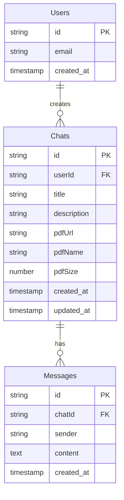

# Leafra: AI-Powered PDF RAG System

Leafra is a sophisticated Next.js full-stack application designed to revolutionize how users interact with PDF documents. It leverages Retrieval-Augmented Generation (RAG) to enable users to upload PDFs, ask questions, and receive AI-powered, contextually relevant answers. The system is built with modern React patterns, a robust backend for data persistence, and integrates various AI and infrastructure components for a seamless user experience.

## Core Features

Leafra offers a rich set of features to enhance document interaction:

*   **📄 PDF Upload & Processing:** Users can upload PDF documents (up to 8MB) which are then automatically processed and analyzed by the AI.
*   **🤖 AI-Powered Chat Interface:** Engage in conversational Q&A directly with your documents, receiving accurate and contextualized responses.
*   **🔍 Vector Search:** Utilizes vector-based semantic search to efficiently surface the most relevant information within your documents.
*   **🔐 Secure Authentication:** Supports both email/password and OAuth (Google, GitHub, Discord) for secure and flexible user access.
*   **📊 Real-time Chat Streaming:** Experience instant responses with real-time streaming, ideal for detailed or lengthy answers.
*   **🗄️ PostgreSQL Database:** Robust data persistence for user accounts, chat history, and document metadata.
*   **⚡ Background Job Processing:** Employs BullMQ for efficient and asynchronous handling of tasks like PDF parsing and embedding.

---

## How it Works: The RAG Pipeline

Leafra operates on a Retrieval-Augmented Generation (RAG) model, combining document retrieval with AI generation to provide accurate answers grounded in your uploaded PDFs.

### High-Level Architecture

The system orchestrates several key components to deliver its functionality:

```mermaid
flowchart LR
    subgraph User Interface
        A[Next.js Frontend]
    end
    subgraph Backend Services
        B[Next.js API Routes/Server Actions]
        C[Authentication (BetterAuth)]
        D[Database (PostgreSQL)]
        E[Background Worker (BullMQ)]
        F[Vector Database (Pinecone)]
        G[AI Models (Embeddings & LLM)]
    end
    subgraph Data Processing
        H[PDF Parsing & Chunking]
        I[Embedding Generation]
    end

    A --> B
    B --> C
    B --> D
    B --> E
    E --> H
    H --> I
    I --> F
    B --> F
    B --> G
    F --> B
    G --> B
```

### Document Processing Flow

When a PDF is uploaded, it undergoes a series of transformations:

1.  **PDF Upload:** User uploads a PDF file.
2.  **Parsing & Chunking:** The PDF is parsed into raw documents, and then split into smaller, manageable chunks.
    ```typescript
    // source: lib/worker.ts:L92
    // Note: This snippet illustrates the concept; actual implementation may vary.
    import { WebPDFLoader } from "langchain/document_loaders/web/pdf";
    import { RecursiveCharacterTextSplitter } from "langchain/text_splitter";

    async function processDocument(fileUrl: string) {
      const rawDocs = await new WebPDFLoader(blob, { splitPages: true }).load();
      const textSplitter = new RecursiveCharacterTextSplitter({
        chunkSize: 1000,
        chunkOverlap: 200,
      });
      const docs = await textSplitter.splitDocuments(rawDocs);
      // ... further processing
    }
    ```
3.  **Embedding Generation:** Each chunk is converted into a dense vector embedding using an AI model.
    ```typescript
    // source: lib/worker.ts:L92 (conceptual)
    import { Embeddings } from "@langchain/core/embeddings"; // Example import

    const embeddings = new PremEmbeddings({ apiKey: env.PREM_API_KEY, model: "@cf/baai/bge-small-en-v1.5" });
    const vectors = await Promise.all(docs.map(async (doc, idx) => {
      const id = `${fileUrl}-${doc.metadata.loc.pageNumber}-${idx}`;
      const values = await embeddings.embedQuery(doc.pageContent);
      return { id, values, metadata: { content: doc.pageContent } };
    }));
    ```
4.  **Vector Storage:** These embeddings are stored in a vector database (Pinecone) under a namespace corresponding to the chat ID.
    ```typescript
    // source: lib/worker.ts:L92 (conceptual)
    import { Pinecone } from "@pinecone-database/pinecone";

    const pinecone = new Pinecone();
    const index = pinecone.index("leafravectordb");
    const namespace = index.namespace(job.data.chatId);
    await namespace.upsert(vectors);
    ```

### Querying and Response Generation

When a user asks a question:

1.  **Embed Query:** The user's question is embedded into a vector.
2.  **Vector Search:** The system queries the Pinecone namespace for the most similar document chunks (top-K).
3.  **Contextual Prompting:** The retrieved chunks are used as context to prompt a Large Language Model (LLM).
4.  **AI Response:** The LLM generates an answer based on the provided context.
5.  **Streaming & Storage:** The answer is streamed back to the user in real-time, and the conversation is persisted in PostgreSQL.



---

## Key Technologies & Integrations

Leafra leverages a modern tech stack for its functionality:

*   **Frontend:** Next.js, React, Tailwind CSS
*   **Backend:** Next.js API Routes/Server Actions, PostgreSQL (via Drizzle ORM)
*   **Authentication:** BetterAuth
*   **AI:** LangChain.js (for document loading, splitting, and LLM integration), PremEmbeddings, potentially other LLM providers.
*   **Vector Database:** Pinecone
*   **Background Jobs:** BullMQ
*   **UI Components:** Shadcn/ui

---

## Getting Started

1.  **Create an Account:** Sign up using email/password or OAuth.
2.  **Create a Chat:** Start a new chat session.
3.  **Upload PDF:** Upload your PDF document (up to 8MB).
4.  **Ask Questions:** Engage with your document by asking questions in the chat interface.

> [!TIP]
> **Suggestion:** The `workSection` parameter in `createChat` is currently dropped. Consider adding a corresponding column to the `chat` table in the database schema to store this information if it's intended for future use.

---

## Security & Privacy

Leafra prioritizes data security and user privacy:

*   **Secure Authentication:** Robust authentication mechanisms protect user accounts.
*   **Data Encryption:** Documents and data are processed and stored securely.
*   **Privacy Focus:** The application is designed with user privacy as a core principle.

> [!IMPORTANT]
> **Critical Improvement:** The `account.scope` field is currently stored as a comma-separated string. This makes querying for specific scopes inefficient and ambiguous. Consider migrating this to a `jsonb` array type with a GIN index for optimized and precise scope management.

```sql
-- Proposed schema change for account scopes
ALTER TABLE "account" ADD COLUMN scopes jsonb;
-- backfill:
UPDATE "account"
SET scopes = to_jsonb(string_to_array(scope, ','))
WHERE scope IS NOT NULL;
CREATE INDEX account_scopes_gin ON "account" USING GIN (scopes);
```

---

## Glossary of Terms

*   **RAG (Retrieval-Augmented Generation):** A technique that enhances LLMs by retrieving relevant information from a knowledge base before generating a response. This grounds the AI's answers in specific documents, reducing hallucinations.
*   **Document AI:** The application of AI to understand, extract, and reason over document content, enabling features like intelligent search and Q&A.
*   **PDF (Portable Document Format):** A standard file format for documents that preserves layout and is widely used. Leafra parses PDFs to make their content accessible to AI.
*   **Vector Search:** A method of searching data based on vector embeddings, allowing for semantic similarity searches rather than just keyword matching.

---

## Support & Help

For assistance with account setup, PDF uploads, AI chat, or troubleshooting, please visit the [Support Center](https://leafra-eight.vercel.app/support).
